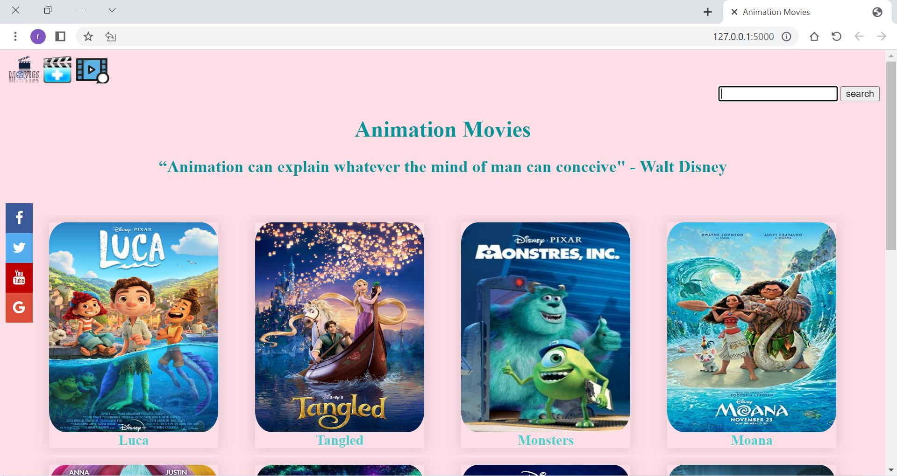

<h1 style="color:#f6adc6;">  Welcome to my Flask Movie App 🎥 </h1>
<h4>Author: Raghda Knaane</h4>

<h1 style="color:#f6adc6;"> Description:</h1>
Flask application, My Flask application manages a list of animation movies created by users. We can delete, update,
add and rate the films.

<h2 style="color:#f6adc6;">A movie application:</h2>

<h1 style="color:#f6adc6;">Installation:</h1> 

1. Install the required packages: Flask , flask-sqlalchemy ,Flask-Migrate in my python project.
2. Import the modules we need: Flask, render_template, request, redirect, url_for,Migrate, migrate,SQLAlchemy and OS.
3. Create the database and import the sample data.
4. Update the database configuration in the `config.py` file
5. Run the application: `python app.py`

<h1 style="color:#f6adc6;"> Usage:</h1>

- Run the application by executing `python app.py`
- Open a web browser and navigate to `http://localhost:5000`
- View the list of the animation movies posters .
- There is an option to add new film to the list by "add_profile" page
- Click in one photo to open a page with the details of this movie by "movie_info" page.
- There is an option to add a review by the user in "movie_info" page.
- There is an option to delete or change details in the "movie_info" page by two buttons `Delete` `Alter`.
- The update button take the user to alter_info page where can he change or update new information.
- The delete button delete the poster and the information about the video form the database table.

<h1 style="color:#f6adc6;"> Built With:</h1>

- [Python](https://www.python.org/) - The programming language used
- [Flask](https://flask.palletsprojects.com/) - The web framework used
- [HTML] - Markup Language
- [Django] - Python web framework 
-  CSS framework used for styling

<h2 style="color:#f6adc6;">Design:</h2>
Two CSS files styled my application, one for the homepage and one for the rest.

<h1 style="color:#f6adc6;"> built by: </h1>

Depending on the  project directory and the contents of the files, I will divide the contents:
1. README.md 
2. app.py - it contain code that sets uo the application
3. templates - it contain all the HTML files 
4. static - it contain the upload images and the two CSS files
5. instance - file that contains configuration settings or data specific to an individual instance of a software application
6. migrations - is a versioned change to the database schema, used for version control and to keep track of changes made to the database over time.

<h1 style="color:#f6adc6;"> Testing: </h1>

I checked all things manually
The following tests we may run in the application to ensure it's functioning correctly:
1. Unit tests: to test individual functions and modules
2. Integration tests: to test the interaction between different parts of the application.
3. Functional tests: to test end-to-end functionality of the application, simulating a user's actions.
4. Load tests: to test the performance and scalability of the application under heavy loads.
5. Security tests: to test for vulnerabilities and ensure data protection.
6. Usability tests: to test the user interface and the user experience of the application.

<h1 style="color:#f6adc6;">Features: </h1>

Here are the features in summary:
<li>App displays Animation Movies.</li>
<li> Users can search for the movies with the keywords.</li>
<li> Users can register and write reviews about the movies.</li>

<h1 style="color:#f6adc6;"> Contributing:</h1>

1. Fork the repository
2. Create a new branch for your feature
3. Commit your changes
4. Push to your branch
5. Create a pull request

